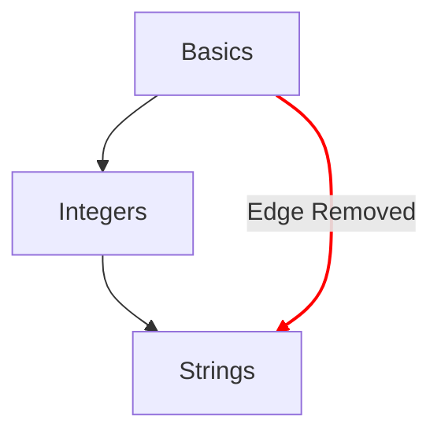

# خريطة المفاهيم

تُعد خريطة المفاهيم إحدى الطرق الرئيسية لتوضيح التقدم الذي يحققه الطالب عبر تمارين المفاهيم.

## أهداف التصميم

- تقديم خريطة مفاهيم ذات معنى تربط الأفكار من البسيط إلى المركّب.
- توفير مسار يقود إلى الطلاقة في اللغة.
- توضيح التقدم خلال محتويات الدورة.

## البنية

- العقد
  - يُمثَّل كل مفهوم بعقدة على خريطة المفاهيم.
  - توفير مرجع سريع بأنماطها للدلالة على درجة التقدم.
    - متقن: المفاهيم التي اكتمل تمرينها التعليمي وجميع تمارينها التطبيقية المرتبطة.
    - مكتمل: المفاهيم التي اكتمل تمرينها التعليمي، لكن تمرينًا تطبيقيًا واحدًا أو أكثر لم يكتمل بعد.
    - متاح: المفاهيم التي لم يكتمل تمرينها التعليمي بعد.
    - مغلق: المفاهيم التي يتطلب تمرينها التعليمي إكمال واحد أو أكثر من التمارين المتطلبة السابقة.
- المسارات
  - توفير علاقة تربط مفهومًا بالمفهوم التالي.
  - توفير علاقة توضح اللبنات الأساسية لمفهوم وصولًا إلى الجذر.

## الإعدادات

تتحدد إعدادات خريطة المفاهيم بتفاصيل ملف [`config.json`](/docs/building/tracks/config-json) المرتبط بالمسار.
وبوجه التحديد، تحدد مواصفات تمارين المفاهيم شكل خريطة المفاهيم وتخطيطها.

> يمكنك الاطلاع على الكود المستخدم لحساب مواصفات خريطة المفاهيم على GitHub: [Exercism/website: determine_concept_map_layout.rb][github-concept-code]

يحدد تمرين المفهوم متطلباته السابقة، وكذلك المفهوم الذي يعلّمه عند إكماله.
وإذا ترجمنا هذا إلى مصطلحات [الرسم البياني][wikipedia-graph]:
- يمثل المفهوم _رأسًا_ (يُعرف أيضًا بـ _عقدة_)
- يحدد تمرين المفهوم _حافة موجهة_ واحدة أو أكثر بين _رأسين_ (_عقدتين_)

من المهم ملاحظة أن ليس كل الحواف التي يمكن تحديدها من `config.json` تظهر في النتيجة؛ فلا تُختار إلا الحواف الواردة من المستوى السابق.

[github-concept-code]: https://github.com/exercism/website/blob/main/app/commands/track/determine_concept_map_layout.rb
[wikipedia-graph]: https://en.wikipedia.org/wiki/Graph_(discrete_mathematics)
