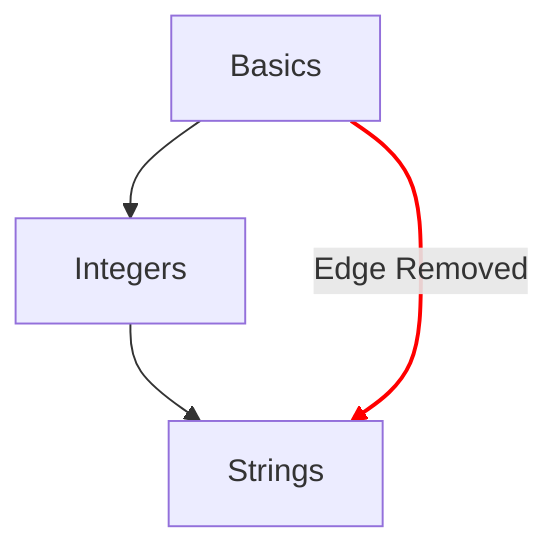

# কনসেপ্ট ম্যাপ

কনসেপ্ট ম্যাপ হলো সেই প্রধান পদ্ধতিগুলোর একটি, যা দিয়ে দেখানো হয় একজন শিক্ষার্থী কনসেপ্ট অনুশীলনীগুলোর মধ্য দিয়ে কী অগ্রগতি করে।

## ডিজাইনের লক্ষ্য

- সহজ থেকে জটিল ধারণা পর্যন্ত একটি অর্থবহ কনসেপ্ট ম্যাপ দেওয়া।
- একটি ভাষায় সাবলীলতার দিকে নিয়ে যাওয়া একটি পথ দেওয়া।
- কোর্সের বিষয়বস্তুর মধ্য দিয়ে অগ্রগতি চিত্রিত করা।

## গঠন

- নোড
  - কনসেপ্ট ম্যাপে প্রতিটি ধারণাকে একটি নোড দিয়ে প্রকাশ করা হয়।
  - অগ্রগতির মাত্রা বোঝাতে এগুলোর স্টাইলসহ একটি দ্রুত রেফারেন্স দেওয়া হয়।
    - আয়ত্ত: যেসব ধারণার কনসেপ্ট অনুশীলনী এবং সংশ্লিষ্ট সব প্র্যাকটিস অনুশীলনী সম্পূর্ণ হয়েছে।
    - সম্পূর্ণ: যেসব ধারণার কনসেপ্ট অনুশীলনী সম্পূর্ণ হয়েছে, কিন্তু এক বা একাধিক প্র্যাকটিস অনুশীলনী সম্পূর্ণ হয়নি।
    - উপলব্ধ: যেসব ধারণার কনসেপ্ট অনুশীলনী সম্পূর্ণ হয়নি।
    - লকড: যেসব ধারণার কনসেপ্ট অনুশীলনী সম্পূর্ণ করতে এক বা একাধিক পূর্বশর্ত অনুশীলনী সম্পূর্ণ করা প্রয়োজন।
- পাথ
  - এক ধারণার সাথে পরের ধারণার সম্পর্ক দেখানো হয়।
  - মূল পর্যন্ত একটি ধারণার গঠন উপাদানগুলো নির্দেশ করে এমন সম্পর্ক দেখানো হয়।

## কনফিগারেশন

একটি ট্র্যাকের সাথে যুক্ত [`config.json`](/docs/building/tracks/config-json) ফাইলের বিস্তারিত তথ্য দিয়ে কনসেপ্ট ম্যাপের কনফিগারেশন নির্ধারিত হয়।
বিশেষভাবে, কনসেপ্ট অনুশীলনীগুলোর স্পেসিফিকেশনই কনসেপ্ট ম্যাপের আকৃতি ও লেআউট নির্ধারণ করে।

> কনসেপ্ট ম্যাপের স্পেসিফিকেশন হিসাব করার কোডটি GitHub-এ দেখতে পারেন: [Exercism/website: determine_concept_map_layout.rb][github-concept-code]

একটি কনসেপ্ট অনুশীলনী তার পূর্বশর্তগুলো এবং শেষ হলে যে ধারণা শেখায়, তা নির্দিষ্ট করে।
এটিকে যদি একটি [গ্রাফ][wikipedia-graph]-এর পরিভাষায় অনুবাদ করি:
- একটি ধারণা একটি _ভার্টেক্স_ বোঝায় (যা _নোড_ নামেও পরিচিত)।
- একটি কনসেপ্ট অনুশীলনী দুইটি _ভার্টেক্স_ (_নোড_)-এর মধ্যে এক বা একাধিক _ডিরেক্টেড এজ_ নির্ধারণ করে।

লক্ষ করা জরুরি যে, `config.json` থেকে যেসব এজ নির্দিষ্ট করা যেত সেগুলোর সবগুলোই ফলাফলে দেখা যায় না; কেবল পূর্ববর্তী লেভেলের এজগুলোই নির্বাচন করা হয়।

[github-concept-code]: https://github.com/exercism/website/blob/main/app/commands/track/determine_concept_map_layout.rb
[wikipedia-graph]: https://en.wikipedia.org/wiki/Graph_(discrete_mathematics)
