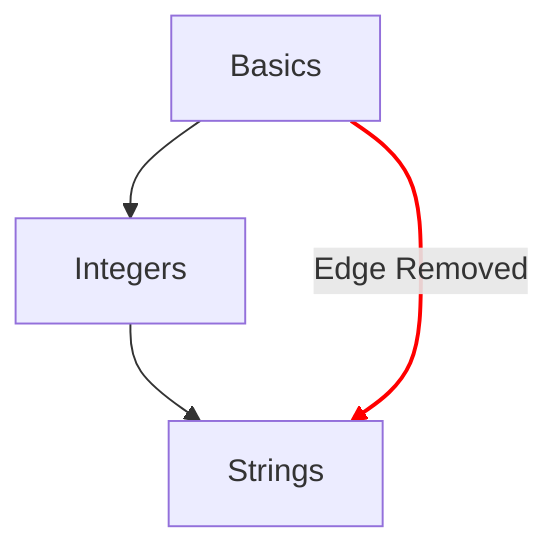

# Konzeptkarte

Die Konzeptkarte ist eine der wichtigsten Methoden, um den Fortschritt zu veranschaulichen, den ein Lernender bei den Konzeptübungen macht.

## Designziele

- Eine aussagekräftige Konzeptkarte von einfachen bis zu komplexen Ideen bieten.
- Einen Weg hin zu fließender Beherrschung einer Programmiersprache aufzeigen.
- Den Fortschritt durch die Kursinhalte veranschaulichen.

## Aufbau

- Knoten
  - Jedes Konzept wird durch einen Knoten auf der Konzeptkarte dargestellt.
  - Eine schnelle Übersicht mit ihrer Darstellung bieten, die den Grad des Fortschritts anzeigt.
    - Beherrscht: Konzepte, deren Lernübung und alle zugehörigen Praxisübungen abgeschlossen sind.
    - Abgeschlossen: Konzepte, deren Lernübung abgeschlossen ist, bei denen aber eine oder mehrere Praxisübungen noch nicht abgeschlossen sind.
    - Verfügbar: Konzepte, deren Lernübung noch nicht abgeschlossen ist.
    - Gesperrt: Konzepte, deren Lernübung erst verfügbar wird, wenn eine oder mehrere Voraussetzungsübungen abgeschlossen sind.
- Pfade
  - Zeigen die Beziehung eines Konzepts zum nächsten.
  - Zeigen die Beziehung, die die Bausteine eines Konzepts bis zurück zur Wurzel angibt.

## Konfiguration

Die Konfiguration der Konzeptkarte ergibt sich aus den Details der [`config.json`](/docs/building/tracks/config-json), die zu einem Track gehört.
Konkret bestimmt die Spezifikation der Konzeptübungen die Form und das Layout der Konzeptkarte.

> Du kannst den Code, mit dem die Spezifikation der Konzeptkarte berechnet wird, auf GitHub ansehen: [Exercism/website: determine_concept_map_layout.rb][github-concept-code]

Eine Konzeptübung gibt ihre Voraussetzungen an und außerdem das Konzept, das sie nach Abschluss vermittelt.
Übertragen wir das auf die Begriffe eines [Graphen][wikipedia-graph]:
- Ein Konzept stellt eine _Ecke_ dar (auch als _Knoten_ bekannt).
- Eine Konzeptübung bestimmt eine oder mehrere _gerichtete Kanten_ zwischen zwei _Ecken_ (_Knoten_).

Wichtig: Nicht alle Kanten, die sich aus der `config.json` ergeben könnten, erscheinen im Ergebnis. Es werden nur die Kanten der vorhergehenden Ebene ausgewählt.

[github-concept-code]: https://github.com/exercism/website/blob/main/app/commands/track/determine_concept_map_layout.rb
[wikipedia-graph]: https://en.wikipedia.org/wiki/Graph_(discrete_mathematics)
