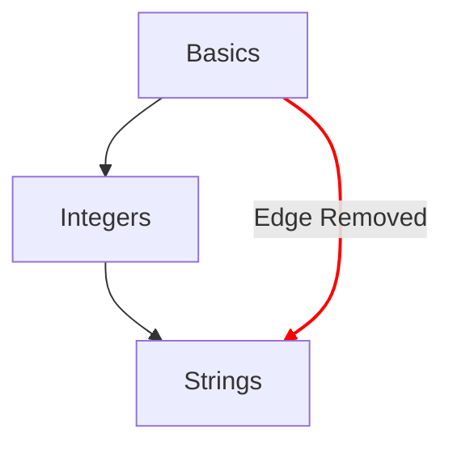

# Χάρτης Εννοιών

Ο χάρτης εννοιών είναι μία από τις βασικές μεθόδους για να απεικονιστεί η πρόοδος που κάνει ένας μαθητής μέσα από τις ασκήσεις εννοιών.

## Στόχοι Σχεδιασμού

- Να παρέχει έναν ουσιαστικό χάρτη εννοιών, από απλές σε σύνθετες ιδέες.
- Να παρέχει μια πορεία προς την ευχέρεια σε μια γλώσσα.
- Να απεικονίζει την πρόοδο μέσα στο περιεχόμενο του μαθήματος.

## Δομή

- Κόμβοι
  - Κάθε έννοια αναπαρίσταται από έναν κόμβο στον χάρτη εννοιών.
  - Παρέχουν μια γρήγορη αναφορά με το στυλ τους, που δείχνει τον βαθμό προόδου.
    - Κατακτημένη: Έννοιες των οποίων η άσκηση εκμάθησης και όλες οι σχετικές ασκήσεις πρακτικής έχουν ολοκληρωθεί.
    - Ολοκληρωμένη: Έννοιες των οποίων η άσκηση εκμάθησης έχει ολοκληρωθεί, αλλά μία ή περισσότερες ασκήσεις πρακτικής δεν έχουν ολοκληρωθεί.
    - Διαθέσιμη: Έννοιες των οποίων η άσκηση εκμάθησης δεν έχει ολοκληρωθεί.
    - Κλειδωμένη: Έννοιες των οποίων η άσκηση εκμάθησης απαιτεί την ολοκλήρωση μίας ή περισσότερων προαπαιτούμενων ασκήσεων.
- Μονοπάτια
  - Δείχνουν τη σχέση μιας έννοιας με την επόμενη.
  - Δείχνουν μια σχέση που υποδεικνύει τα δομικά στοιχεία μιας έννοιας, πίσω ως τη ρίζα.

## Διαμόρφωση

Η διαμόρφωση του χάρτη εννοιών καθορίζεται από λεπτομέρειες του [`config.json`](/docs/building/tracks/config-json) που σχετίζεται με μια διαδρομή.
Συγκεκριμένα, η προδιαγραφή των ασκήσεων εννοιών καθορίζει το σχήμα και τη διάταξη του χάρτη εννοιών.

> Μπορείς να δεις τον κώδικα που χρησιμοποιείται για τον υπολογισμό της προδιαγραφής του χάρτη εννοιών στο GitHub: [Exercism/website: determine_concept_map_layout.rb][github-concept-code]

Μια άσκηση εννοιών προσδιορίζει τις προαπαιτήσεις της και επίσης την έννοια που διδάσκει με την ολοκλήρωσή της.
Αν το μεταφράσουμε αυτό στους όρους ενός [γράφου][wikipedia-graph]:
- Μια έννοια αντιπροσωπεύει μια _κορυφή_ (γνωστή και ως _κόμβος_)
- Μια άσκηση εννοιών καθορίζει μία ή περισσότερες _κατευθυνόμενες ακμές_ μεταξύ δύο _κορυφών_ (_κόμβων_)

Είναι σημαντικό να σημειωθεί ότι δεν εμφανίζονται όλες οι ακμές που θα μπορούσαν να προσδιοριστούν από το `config.json` στο αποτέλεσμα, αλλά επιλέγονται μόνο οι ακμές από το προηγούμενο επίπεδο.

[github-concept-code]: https://github.com/exercism/website/blob/main/app/commands/track/determine_concept_map_layout.rb
[wikipedia-graph]: https://en.wikipedia.org/wiki/Graph_(discrete_mathematics)
