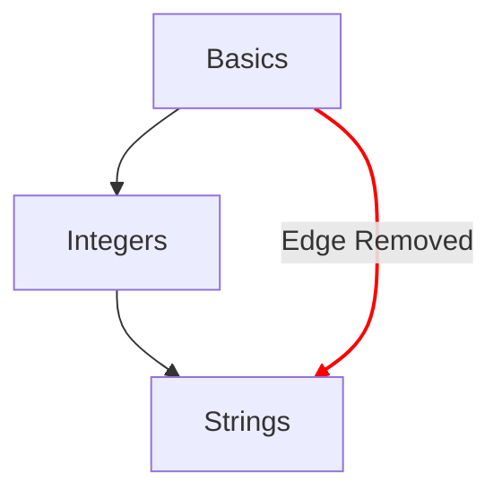

# Mapa de conceptos

El mapa de conceptos es uno de los principales métodos para ilustrar la progresión que sigue un estudiante a través de los ejercicios de concepto.

## Objetivos de diseño

- Ofrecer un mapa de conceptos significativo, de las ideas simples a las complejas.
- Ofrecer un camino hacia la fluidez en un lenguaje.
- Ilustrar la progresión a través de los contenidos del curso.

## Estructura

- Nodos
  - Cada concepto se representa con un nodo en el mapa de conceptos.
  - Se ofrece una referencia rápida con su estilo para indicar el grado de progresión.
    - Dominados: conceptos cuyo ejercicio de aprendizaje y todos los ejercicios de práctica asociados están completos.
    - Completos: conceptos cuyo ejercicio de aprendizaje está completo, pero uno o más ejercicios de práctica no lo están.
    - Disponibles: conceptos cuyo ejercicio de aprendizaje aún no se completó.
    - Bloqueados: conceptos cuyo ejercicio de aprendizaje requiere que se completen uno o más ejercicios previos.
- Caminos
  - Muestran la relación de un concepto con el siguiente.
  - Muestran la relación que conecta los bloques que componen un concepto hasta la raíz.

## Configuración

La configuración del mapa de conceptos se determina a partir de los detalles del [`config.json`](/docs/building/tracks/config-json) asociado a un track.
En concreto, la especificación de los ejercicios de concepto determina la forma y la disposición del mapa de conceptos.

> Puedes ver el código que se usa para calcular la especificación del mapa de conceptos en GitHub: [Exercism/website: determine_concept_map_layout.rb][github-concept-code]

Un ejercicio de concepto especifica sus requisitos previos y también el concepto que enseña al completarse.
Si llevamos esto a los términos de un [grafo][wikipedia-graph]:
- Un concepto representa un _vértice_ (también conocido como _nodo_).
- Un ejercicio de concepto determina una o más _aristas dirigidas_ entre dos _vértices_ (_nodos_).

Es importante tener en cuenta que no todas las aristas que podrían especificarse desde el `config.json` aparecen en el resultado: solo se seleccionan las aristas del nivel anterior.

[github-concept-code]: https://github.com/exercism/website/blob/main/app/commands/track/determine_concept_map_layout.rb
[wikipedia-graph]: https://en.wikipedia.org/wiki/Graph_(discrete_mathematics)
