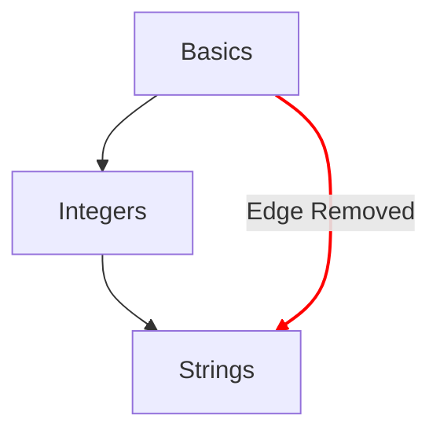

# نقشه‌ی مفاهیم

نقشه‌ی مفاهیم یکی از روش‌های اصلی برای نشان دادن مسیری است که یادگیرنده در تمرین‌های مفهومی طی می‌کند.

## اهداف طراحی

- ارائه‌ی نقشه‌ی مفاهیمی معنادار، از ایده‌های ساده تا ایده‌های پیچیده.
- ارائه‌ی مسیری به سوی تسلط بر یک زبان.
- نشان دادن روند پیشرفت در محتوای دوره.

## ساختار

- گره‌ها
  - هر مفهوم با یک گره روی نقشه‌ی مفاهیم نمایش داده می‌شود.
  - هر گره با سبک خود راهنمای سریعی فراهم می‌کند که میزان پیشرفت را نشان می‌دهد.
    - «Mastered»: مفاهیمی که تمرین یادگیری و همه‌ی تمرین‌های عملی مرتبط با آن‌ها کامل شده است.
    - «Complete»: مفاهیمی که تمرین یادگیری‌شان کامل شده، اما یک یا چند تمرین عملی‌شان کامل نشده است.
    - «Available»: مفاهیمی که تمرین یادگیری‌شان کامل نشده است.
    - «Locked»: مفاهیمی که تمرین یادگیری‌شان نیازمند کامل شدن یک یا چند تمرین پیش‌نیاز است.
- مسیرها
  - رابطه‌ی یک مفهوم را با مفهوم بعدی نشان می‌دهند.
  - رابطه‌ای را نشان می‌دهند که اجزای سازنده‌ی یک مفهوم را تا ریشه بازمی‌گرداند.

## پیکربندی

پیکربندی نقشه‌ی مفاهیم بر اساس جزئیات [`config.json`](/docs/building/tracks/config-json) مربوط به یک مسیر تعیین می‌شود.
به‌طور خاص، مشخصات تمرین‌های مفهومی شکل و چیدمان نقشه‌ی مفاهیم را تعیین می‌کند.

> می‌توانید کدی را که برای محاسبه‌ی مشخصات نقشه‌ی مفاهیم استفاده می‌شود در GitHub ببینید: [Exercism/website: determine_concept_map_layout.rb][github-concept-code]

هر تمرین مفهومی پیش‌نیازهایش و همچنین مفهومی را که پس از اتمام آموزش می‌دهد مشخص می‌کند.
اگر این را به زبان [گراف][wikipedia-graph] ترجمه کنیم:
- هر مفهوم یک _رأس_ را نمایش می‌دهد (که به آن _گره_ هم می‌گویند).
- هر تمرین مفهومی یک یا چند _یال جهت‌دار_ میان دو _رأس_ (_گره_) را تعیین می‌کند.

توجه به این نکته مهم است که همه‌ی یال‌هایی که می‌توانند از `config.json` مشخص شوند در نتیجه ظاهر نمی‌شوند؛ فقط یال‌های سطح قبلی انتخاب می‌شوند.

[github-concept-code]: https://github.com/exercism/website/blob/main/app/commands/track/determine_concept_map_layout.rb
[wikipedia-graph]: https://en.wikipedia.org/wiki/Graph_(discrete_mathematics)
