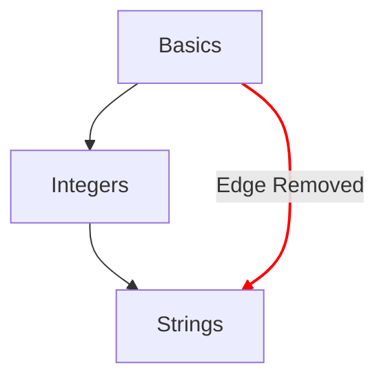

# Carte conceptuelle

La carte conceptuelle est l'une des principales méthodes pour illustrer la progression d'un apprenant à travers les exercices d'apprentissage.

## Objectifs de conception

- Fournir une carte conceptuelle pertinente des idées, des plus simples aux plus complexes.
- Proposer un chemin vers la maîtrise d'un langage.
- Illustrer la progression à travers le contenu du cours.

## Structure

- Nœuds
  - Chaque concept est représenté par un nœud sur la carte conceptuelle.
  - Fournir une référence rapide avec leur style pour indiquer le degré de progression.
    - Maîtrisé : les concepts dont l'exercice d'apprentissage et tous les exercices d'entraînement associés sont terminés.
    - Terminé : les concepts dont l'exercice d'apprentissage est terminé, mais dont un ou plusieurs exercices d'entraînement ne le sont pas.
    - Disponible : les concepts dont l'exercice d'apprentissage n'a pas encore été terminé.
    - Verrouillé : les concepts dont l'exercice d'apprentissage nécessite qu'un ou plusieurs exercices prérequis soient terminés.
- Chemins
  - Fournir une relation d'un concept au suivant.
  - Fournir une relation indiquant les briques de base d'un concept jusqu'à la racine.

## Configuration

La configuration de la carte conceptuelle est déterminée par les détails du [`config.json`](/docs/building/tracks/config-json) associé à un parcours.
Concrètement, la spécification des exercices d'apprentissage détermine la forme et la disposition de la carte conceptuelle.

> Tu peux consulter le code utilisé pour calculer la spécification de la carte conceptuelle sur GitHub : [Exercism/website: determine_concept_map_layout.rb][github-concept-code]

Un exercice d'apprentissage spécifie ses prérequis ainsi que le concept qu'il enseigne une fois terminé.
Si on traduit cela dans les termes d'un [graphe][wikipedia-graph] :
- Un concept représente un _sommet_ (aussi appelé _nœud_)
- Un exercice d'apprentissage détermine un ou plusieurs _arcs orientés_ entre deux _sommets_ (_nœuds_)

Il est important de noter que tous les arcs susceptibles d'être spécifiés depuis le `config.json` n'apparaissent pas dans le résultat : seuls les arcs du niveau précédent sont sélectionnés.

[github-concept-code]: https://github.com/exercism/website/blob/main/app/commands/track/determine_concept_map_layout.rb
[wikipedia-graph]: https://en.wikipedia.org/wiki/Graph_(discrete_mathematics)
