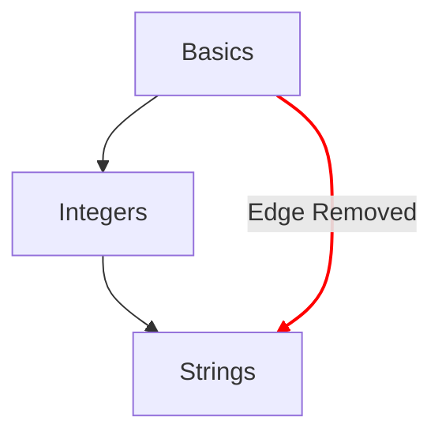

# कॉन्सेप्ट मैप

कॉन्सेप्ट मैप यह दिखाने के मुख्य तरीकों में से एक है कि एक छात्र कॉन्सेप्ट अभ्यासों के ज़रिए कैसी प्रगति करता है।

## डिज़ाइन के उद्देश्य

- सरल से जटिल विचारों तक का एक सार्थक कॉन्सेप्ट मैप देना।
- किसी भाषा में निपुणता तक पहुँचने का रास्ता देना।
- कोर्स की सामग्री में होने वाली प्रगति को दिखाना।

## संरचना

- नोड
  - कॉन्सेप्ट मैप पर हर कॉन्सेप्ट को एक नोड से दिखाया जाता है।
  - प्रगति की मात्रा बताने के लिए इन नोड की शैली के साथ एक त्वरित संदर्भ देना।
    - महारत हासिल: वे कॉन्सेप्ट जिनका कॉन्सेप्ट अभ्यास और उससे जुड़े सभी प्रैक्टिस अभ्यास पूरे हो चुके हैं।
    - पूरा: वे कॉन्सेप्ट जिनका कॉन्सेप्ट अभ्यास पूरा हो चुका है, लेकिन एक या अधिक प्रैक्टिस अभ्यास पूरे नहीं हुए हैं।
    - उपलब्ध: वे कॉन्सेप्ट जिनका कॉन्सेप्ट अभ्यास अभी पूरा नहीं हुआ है।
    - लॉक: वे कॉन्सेप्ट जिनके कॉन्सेप्ट अभ्यास के लिए एक या अधिक पूर्व-आवश्यक अभ्यास पूरे करना ज़रूरी है।
- पथ
  - एक कॉन्सेप्ट का अगले कॉन्सेप्ट से संबंध देना।
  - किसी कॉन्सेप्ट के निर्माण खंडों का मूल तक का संबंध दिखाना।

## कॉन्फिगरेशन

कॉन्सेप्ट मैप का कॉन्फिगरेशन किसी ट्रैक से जुड़े [`config.json`](/docs/building/tracks/config-json) की जानकारियों से तय होता है।
खास तौर पर, कॉन्सेप्ट अभ्यासों का स्पेसिफिकेशन ही कॉन्सेप्ट मैप का आकार और लेआउट तय करता है।

> कॉन्सेप्ट मैप का स्पेसिफिकेशन निकालने में इस्तेमाल होने वाला कोड आप GitHub पर देख सकते हैं: [Exercism/website: determine_concept_map_layout.rb][github-concept-code]

एक कॉन्सेप्ट अभ्यास अपनी पूर्व-आवश्यकताएँ बताता है, और यह भी कि वह पूरा होने पर कौन सा कॉन्सेप्ट सिखाता है।
अगर हम इसे [ग्राफ][wikipedia-graph] की शब्दावली में कहें:
- एक कॉन्सेप्ट एक _वर्टेक्स_ को दिखाता है (जिसे _नोड_ भी कहा जाता है)
- एक कॉन्सेप्ट अभ्यास दो _वर्टेक्स_ (_नोड_) के बीच एक या अधिक _डायरेक्टेड एज_ तय करता है

यह ध्यान रखना ज़रूरी है कि `config.json` से जो भी एज तय हो सकते हैं, वे सभी परिणाम में नहीं दिखते। परिणाम में सिर्फ पिछले लेवल के एज ही चुने जाते हैं।

[github-concept-code]: https://github.com/exercism/website/blob/main/app/commands/track/determine_concept_map_layout.rb
[wikipedia-graph]: https://en.wikipedia.org/wiki/Graph_(discrete_mathematics)
