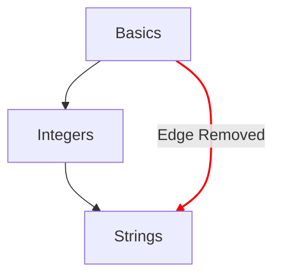

# Fogalomtérkép

A fogalomtérkép az egyik fő eszköz arra, hogy bemutassa, milyen utat jár be egy tanuló a tanulófeladatokon keresztül.

## Tervezési célok

- Érthető fogalomtérképet ad a fogalmakról, az egyszerűtől a bonyolultig.
- Utat mutat a nyelv folyékony használata felé.
- Bemutatja a kurzus tartalmán való előrehaladást.

## Felépítés

- Csomópontok
  - A fogalomtérképen minden fogalmat egy csomópont jelöl.
  - A csomópontok stílusa gyors áttekintést ad az előrehaladás mértékéről.
    - Elsajátítva: azok a fogalmak, amelyeknek a tanulófeladata és az összes hozzá tartozó gyakorlófeladata elkészült.
    - Elkészült: azok a fogalmak, amelyeknek a tanulófeladata elkészült, de egy vagy több gyakorlófeladata még nem.
    - Elérhető: azok a fogalmak, amelyeknek a tanulófeladata még nem készült el.
    - Zárolva: azok a fogalmak, amelyeknek a tanulófeladatához egy vagy több előfeltétel-feladat elvégzése szükséges.
- Útvonalak
  - Egy fogalom és a következő közti kapcsolatot mutatja.
  - Olyan kapcsolatot mutat, amely egy fogalom építőelemeit a gyökér felé vezeti vissza.

## Konfiguráció

A fogalomtérkép konfigurációját a kurzushoz tartozó [`config.json`](/docs/building/tracks/config-json) részletei határozzák meg.
Pontosabban a tanulófeladatok specifikációja határozza meg a fogalomtérkép alakját és elrendezését.

> A fogalomtérkép-specifikáció kiszámításához használt kódot a GitHubon tekintheted meg: [Exercism/website: determine_concept_map_layout.rb][github-concept-code]

A tanulófeladat megadja az előfeltételeit, és azt a fogalmat is, amelyet a befejezésekor tanít.
Ha ezt lefordítjuk egy [gráf][wikipedia-graph] fogalmaira:
- Egy fogalom egy _csúcsot_ (más néven _csomópontot_) jelöl.
- A tanulófeladat egy vagy több _irányított élt_ határoz meg két _csúcs_ (_csomópont_) között.

Fontos megjegyezni, hogy nem minden él jelenik meg az eredményben, amelyet a `config.json` megadhatna: csak az előző szintről származó élek kerülnek kiválasztásra.

[github-concept-code]: https://github.com/exercism/website/blob/main/app/commands/track/determine_concept_map_layout.rb
[wikipedia-graph]: https://en.wikipedia.org/wiki/Graph_(discrete_mathematics)
