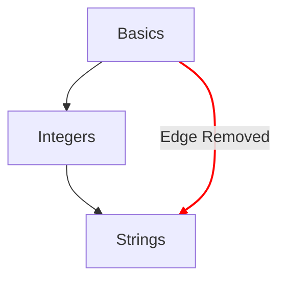

# Mappa dei concetti

La mappa dei concetti è uno dei metodi principali per illustrare il percorso che uno studente compie attraverso gli esercizi sui concetti.

## Obiettivi di progettazione

- Fornire una mappa dei concetti significativa, dalle idee semplici a quelle complesse.
- Fornire un percorso verso la padronanza di un linguaggio.
- Illustrare la progressione attraverso i contenuti del corso.

## Struttura

- Nodi
  - Ogni concetto è rappresentato da un nodo sulla mappa dei concetti.
  - Fornire un riferimento rapido con il loro stile per indicare il grado di avanzamento.
    - Padroneggiato: concetti per cui l'esercizio di apprendimento e tutti gli esercizi di pratica associati sono completati.
    - Completato: concetti per cui l'esercizio di apprendimento è completato, ma uno o più esercizi di pratica non lo sono.
    - Disponibile: concetti per cui l'esercizio di apprendimento non è ancora stato completato.
    - Bloccato: concetti per cui l'esercizio di apprendimento richiede che uno o più esercizi prerequisito siano completati.
- Cammini
  - Fornire una relazione tra un concetto e il successivo.
  - Fornire una relazione che indichi i blocchi costitutivi di un concetto fino alla radice.

## Configurazione

La configurazione della mappa dei concetti è determinata dai dettagli del [`config.json`](/docs/building/tracks/config-json) associato a un track.
In particolare, la specifica degli esercizi sui concetti determina la forma e la disposizione della mappa dei concetti.

> Puoi vedere il codice usato per calcolare la specifica della mappa dei concetti su GitHub: [Exercism/website: determine_concept_map_layout.rb][github-concept-code]

Un esercizio sui concetti specifica i suoi prerequisiti e anche il concetto che insegna al completamento.
Se traduciamo questo nei termini di un [grafo][wikipedia-graph]:
- Un concetto rappresenta un _vertice_ (noto anche come _nodo_)
- Un esercizio sui concetti determina uno o più _archi orientati_ tra due _vertici_ (_nodi_)

È importante notare che non tutti gli archi che si potrebbero specificare dal `config.json` compaiono nel risultato: vengono selezionati solo gli archi del livello precedente.

[github-concept-code]: https://github.com/exercism/website/blob/main/app/commands/track/determine_concept_map_layout.rb
[wikipedia-graph]: https://en.wikipedia.org/wiki/Graph_(discrete_mathematics)
