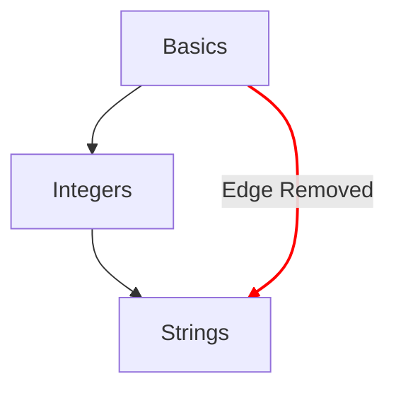

# コンセプトマップ

コンセプトマップは、学習者がコンセプト演習を通してたどる進歩の流れを図で示す、主要な方法の一つです。

## 設計目標

- シンプルなアイデアから複雑なアイデアへと至る、意味のあるコンセプトマップを提供します。
- その言語を使いこなせるようになるまでの道筋を示します。
- コースの内容を通した進歩を図で示します。

## 構造

- ノード
  - それぞれのコンセプトは、コンセプトマップ上のノードとして表されます。
  - ノードのスタイルが進歩の度合いを示す早見表の役割を果たします。
    - マスター済み：コンセプト演習と、それに関連するすべてのプラクティス演習が完了しているコンセプト。
    - 完了：コンセプト演習は完了しているものの、1つ以上のプラクティス演習が完了していないコンセプト。
    - 利用可能：コンセプト演習がまだ完了していないコンセプト。
    - ロック中：コンセプト演習を始めるには、1つ以上の前提となる演習を完了する必要があるコンセプト。
- パス
  - あるコンセプトと次のコンセプトの関係を示します。
  - あるコンセプトの構成要素が、根（ルート）までどのようにつながっているかを示します。

## 設定

コンセプトマップの設定は、トラックに関連付けられた[`config.json`](/docs/building/tracks/config-json)の詳細によって決まります。
具体的には、コンセプト演習の指定がコンセプトマップの形とレイアウトを決めます。

> コンセプトマップの仕様を計算するコードは、GitHubで確認できます：[Exercism/website: determine_concept_map_layout.rb][github-concept-code]

コンセプト演習では、前提となる内容と、完了時に教えるコンセプトを指定します。
これを[グラフ][wikipedia-graph]の用語に置き換えると、次のようになります。
- コンセプトは_頂点_（_ノード_とも呼ばれます）を表します。
- コンセプト演習は、2つの_頂点_（_ノード_）の間に1つ以上の_有向辺_を定めます。

重要な点として、`config.json`から指定できるすべての辺が結果に現れるわけではありません。選択されるのは、1つ前のレベルからの辺だけです。

[github-concept-code]: https://github.com/exercism/website/blob/main/app/commands/track/determine_concept_map_layout.rb
[wikipedia-graph]: https://en.wikipedia.org/wiki/Graph_(discrete_mathematics)
