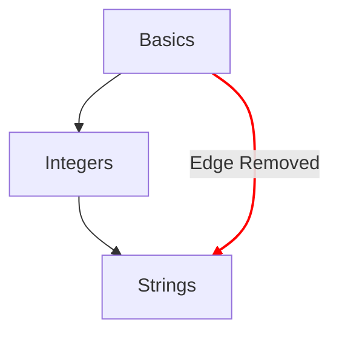

# 개념 지도

개념 지도는 학습자가 개념 연습 문제를 통해 나아가는 진행 과정을 보여 주는 대표적인 방법 중 하나예요.

## 설계 목표

- 단순한 아이디어에서 복잡한 아이디어로 이어지는 의미 있는 개념 지도를 제공해요.
- 언어를 유창하게 구사하는 길을 제시해요.
- 강의 내용을 따라가는 진행 과정을 보여 줘요.

## 구조

- 노드
  - 각 개념은 개념 지도의 노드로 표현돼요.
  - 노드의 스타일로 진행 정도를 한눈에 확인할 수 있어요.
    - Mastered: 개념 연습 문제와 그에 연결된 모든 실습 문제를 완료한 개념
    - Complete: 개념 연습 문제는 완료했지만 실습 문제를 하나 이상 완료하지 않은 개념
    - Available: 개념 연습 문제를 아직 완료하지 않은 개념
    - Locked: 개념 연습 문제를 완료하려면 하나 이상의 선행 연습 문제를 먼저 완료해야 하는 개념
- 경로
  - 한 개념에서 다음 개념으로 이어지는 관계를 보여 줘요.
  - 어떤 개념의 구성 요소가 루트까지 어떻게 이어지는지 보여 주는 관계를 나타내요.

## 구성

개념 지도의 구성은 트랙에 연결된 [`config.json`](/docs/building/tracks/config-json)의 세부 사항에 따라 결정돼요.
구체적으로는 개념 연습 문제의 명세가 개념 지도의 형태와 배치를 결정해요.

> 개념 지도 명세를 계산하는 데 사용되는 코드는 GitHub에서 볼 수 있어요: [Exercism/website: determine_concept_map_layout.rb][github-concept-code]

개념 연습 문제는 자신의 선행 조건과, 완료했을 때 가르치는 개념을 명시해요.
이를 [그래프][wikipedia-graph]의 용어로 옮기면 다음과 같아요:
- 개념은 _꼭짓점_(노드라고도 해요)을 나타내요.
- 개념 연습 문제는 두 _꼭짓점_(_노드_) 사이의 하나 이상의 _방향 간선_을 결정해요.

한 가지 중요한 점은, `config.json`에서 지정할 수 있는 모든 간선이 결과에 나타나지는 않는다는 거예요. 바로 앞 단계의 간선만 선택돼요.

[github-concept-code]: https://github.com/exercism/website/blob/main/app/commands/track/determine_concept_map_layout.rb
[wikipedia-graph]: https://en.wikipedia.org/wiki/Graph_(discrete_mathematics)
