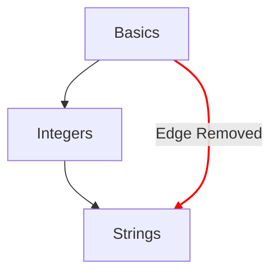

# Mapa de conceitos

O mapa de conceitos é um dos principais métodos para ilustrar a progressão que um estudante percorre pelos exercícios de conceito.

## Objetivos de design

- Fornecer um mapa de conceitos significativo, das ideias simples às complexas.
- Oferecer um caminho rumo à fluência em uma linguagem.
- Ilustrar a progressão pelo conteúdo do curso.

## Estrutura

- Nós
  - Cada conceito é representado por um nó no mapa de conceitos.
  - Ofereça uma referência rápida com o estilo de cada um para indicar o grau de progressão.
    - Dominado: conceitos cujo exercício de conceito e todos os exercícios de prática associados estão concluídos.
    - Concluído: conceitos cujo exercício de conceito está concluído, mas um ou mais exercícios de prática não estão concluídos.
    - Disponível: conceitos cujo exercício de conceito ainda não foi concluído.
    - Bloqueado: conceitos cujo exercício de conceito exige que um ou mais exercícios pré-requisitos sejam concluídos.
- Caminhos
  - Estabeleça uma relação de um conceito com o próximo.
  - Mostre uma relação que indique os blocos de construção de um conceito, remontando até a raiz.

## Configuração

A configuração do mapa de conceitos é determinada pelos detalhes do [`config.json`](/docs/building/tracks/config-json) associado a uma trilha.
Mais especificamente, a especificação dos exercícios de conceito determina o formato e o layout do mapa de conceitos.

> Você pode ver o código usado para calcular a especificação do mapa de conceitos no GitHub: [Exercism/website: determine_concept_map_layout.rb][github-concept-code]

Um exercício de conceito especifica seus pré-requisitos e também o conceito que ensina quando é concluído.
Se traduzirmos isso para os termos de um [grafo][wikipedia-graph]:
- Um conceito representa um _vértice_ (também conhecido como _nó_)
- Um exercício de conceito determina uma ou mais _arestas direcionadas_ entre dois _vértices_ (_nós_)

É importante notar que nem todas as arestas que poderiam ser especificadas no `config.json` aparecem no resultado: apenas as arestas do nível anterior são selecionadas.

[github-concept-code]: https://github.com/exercism/website/blob/main/app/commands/track/determine_concept_map_layout.rb
[wikipedia-graph]: https://en.wikipedia.org/wiki/Graph_(discrete_mathematics)
