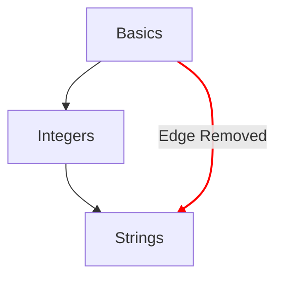

# Mapa de conceitos

O mapa de conceitos é um dos principais métodos para ilustrar a progressão de um estudante ao longo dos exercícios de conceito.

## Objetivos de design

- Proporcionar um mapa de conceitos significativo, de ideias simples a ideias complexas.
- Proporcionar um caminho rumo à fluência numa linguagem.
- Ilustrar a progressão pelos conteúdos do curso.

## Estrutura

- Nós
  - Cada conceito é representado por um nó no mapa de conceitos.
  - Fornecer uma referência rápida com os respetivos estilos para indicar o grau de progressão.
    - Dominado: conceitos cujo exercício de aprendizagem e todos os exercícios de prática associados estão concluídos.
    - Concluído: conceitos cujo exercício de aprendizagem está concluído, mas um ou mais exercícios de prática não estão.
    - Disponível: conceitos cujo exercício de aprendizagem ainda não foi concluído.
    - Bloqueado: conceitos cujo exercício de aprendizagem requer a conclusão de um ou mais exercícios pré-requisitos.
- Caminhos
  - Estabelecer uma relação de um conceito com o seguinte.
  - Estabelecer uma relação que remete os blocos constituintes de um conceito até à raiz.

## Configuração

A configuração do mapa de conceitos é determinada pelos detalhes do [`config.json`](/docs/building/tracks/config-json) associado a um percurso.
Mais concretamente, é a especificação dos exercícios de conceito que determina a forma e a disposição do mapa de conceitos.

> Podes ver o código usado para calcular a especificação do mapa de conceitos no GitHub: [Exercism/website: determine_concept_map_layout.rb][github-concept-code]

Um exercício de conceito especifica os seus pré-requisitos e também o conceito que ensina no final.
Se traduzirmos isto para os termos de um [grafo][wikipedia-graph]:
- Um conceito representa um _vértice_ (também conhecido como _nó_)
- Um exercício de conceito determina uma ou mais _arestas dirigidas_ entre dois _vértices_ (_nós_)

É importante notar que nem todas as arestas que poderiam ser especificadas a partir do `config.json` aparecem no resultado. Só são selecionadas as arestas do nível anterior.

[github-concept-code]: https://github.com/exercism/website/blob/main/app/commands/track/determine_concept_map_layout.rb
[wikipedia-graph]: https://en.wikipedia.org/wiki/Graph_(discrete_mathematics)
