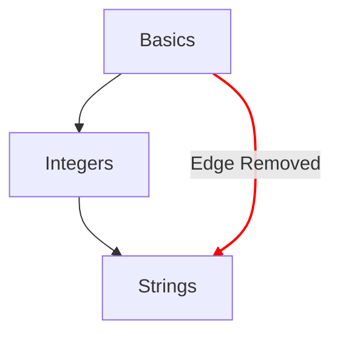

# Карта концепцій

Карта концепцій - один з основних способів показати поступ, який учень проходить через концептуальні вправи.

## Цілі дизайну

- Забезпечити змістовну карту концепцій, що охоплює ідеї від простих до складних.
- Показати шлях до вільного володіння мовою.
- Проілюструвати поступ через зміст курсу.

## Структура

- Вузли
  - Кожну концепцію на карті концепцій представляє вузол.
  - Подавати коротку довідку з їхніми стилями, які вказують на ступінь поступу.
    - Засвоєно: концепції, у яких заверчено навчальну вправу та всі повʼязані практичні вправи.
    - Завершено: концепції, у яких навчальну вправу заверчено, але одну або кілька практичних вправ - ні.
    - Доступно: концепції, навчальну вправу яких ще не заверчено.
    - Заблоковано: концепції, для навчальної вправи яких потрібно завершити одну або кілька попередніх вправ.
- Шляхи
  - Показувати звʼязок однієї концепції з наступною.
  - Показувати звʼязок, який веде від складників концепції назад до кореня.

## Конфігурація

Конфігурацію карти концепцій визначають подробиці [`config.json`](/docs/building/tracks/config-json), повʼязаного з треком.
Зокрема, специфікація концептуальних вправ визначає форму й розташування карти концепцій.

> Переглянути код, який використовується для обчислення специфікації карти концепцій, можна на GitHub: [Exercism/website: determine_concept_map_layout.rb][github-concept-code]

Концептуальна вправа визначає свої передумови, а також концепцію, якої навчає після заверчення.
Якщо описати це термінами [графа][wikipedia-graph]:
- Концепція - це _вершина_ (вона ж _вузол_)
- Концептуальна вправа визначає одне або кілька _напрямлених ребер_ між двома _вершинами_ (_вузлами_)

Важливо зауважити, що не всі ребра, які можна задати в `config.json`, потрапляють у результат: вибираються лише ребра з попереднього рівня.

[github-concept-code]: https://github.com/exercism/website/blob/main/app/commands/track/determine_concept_map_layout.rb
[wikipedia-graph]: https://en.wikipedia.org/wiki/Graph_(discrete_mathematics)
