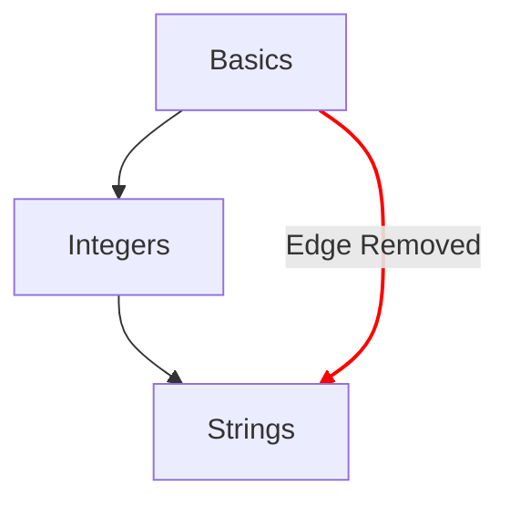

# 概念图

概念图是展示学生在完成概念练习过程中进阶情况的主要方式之一。

## 设计目标

- 提供一张有意义的概念图，呈现从简单到复杂的概念。
- 提供一条通往语言流利的路径。
- 展示课程内容中的进阶过程。

## 结构

- 节点
  - 概念图上的每个概念都由一个节点表示。
  - 用节点的样式提供快速参考，标明进阶程度。
    - 已掌握：学习练习以及所有相关的实践练习都已完成的概念。
    - 已完成：学习练习已完成，但还有一个或多个实践练习未完成的概念。
    - 可用：学习练习尚未完成的概念。
    - 已锁定：学习练习需要先完成一个或多个前置练习的概念。
- 路径
  - 表示概念之间的先后关系。
  - 表示某个概念的组成部分回溯到根节点的关系。

## 配置

概念图的配置由赛道关联的[`config.json`](/docs/building/tracks/config-json)中的细节决定。
具体来说，概念练习的规格决定了概念图的形状和布局。

> 你可以在 GitHub 上查看用于计算概念图规格的代码：[Exercism/website: determine_concept_map_layout.rb][github-concept-code]

一个概念练习会指定它的前置内容，以及完成时所要教授的概念。
如果用图的术语来表述：

- 一个概念代表一个*顶点*（也叫*节点*）
- 一个概念练习决定两个*顶点*（*节点*）之间的一条或多条*有向边*

需要注意的是，并非`config.json`中可能指定的所有边都会出现在结果里，只有上一层级的边会被选中。

[github-concept-code]: https://github.com/exercism/website/blob/main/app/commands/track/determine_concept_map_layout.rb
[wikipedia-graph]: https://en.wikipedia.org/wiki/Graph_(discrete_mathematics)
