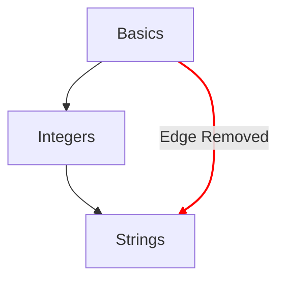

# 概念圖

概念圖是呈現學生在概念練習中學習進程的主要方法之一。

## 設計目標

- 提供一份實用的概念圖，把概念從簡單到複雜排列出來。
- 提供一條通往精通某個程式語言的路徑。
- 呈現課程內容的學習進程。

## 結構

- 節點
  - 概念圖上的每個節點代表一個概念。
  - 以節點樣式提供快速對照，指出學習進展的程度。
    - 已精通：學習練習和所有相關的實作練習都已完成的概念。
    - 已完成：學習練習已完成，但還有一或多個實作練習尚未完成的概念。
    - 可使用：學習練習尚未完成的概念。
    - 已鎖定：學習練習需要先完成一或多個先修練習的概念。
- 路徑
  - 呈現一個概念與下一個概念之間的關係。
  - 呈現某個概念的組成基礎一路回溯到根節點的關係。

## 設定

概念圖的設定取決於軌道所屬的[`config.json`](/docs/building/tracks/config-json)內容細節。
具體來說，概念練習的規格決定了概念圖的形狀與版面配置。

> 你可以在 GitHub 上查看用來計算概念圖規格的程式碼：[Exercism/website: determine_concept_map_layout.rb][github-concept-code]

概念練習會指定它的先修條件，以及完成時所要傳授的概念。
如果我們用[圖][wikipedia-graph]的術語來描述：
- 一個概念代表一個_頂點_（也稱為_節點_）
- 一個概念練習會決定兩個_頂點_（_節點_）之間的一或多條_有向邊_

值得注意的是，並非所有能從`config.json`指定的邊都會出現在結果中，只有來自上一層級的邊會被選取。

[github-concept-code]: https://github.com/exercism/website/blob/main/app/commands/track/determine_concept_map_layout.rb
[wikipedia-graph]: https://en.wikipedia.org/wiki/Graph_(discrete_mathematics)
